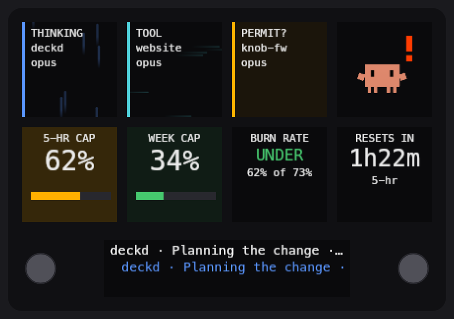
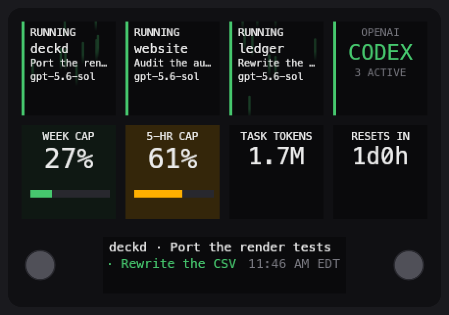
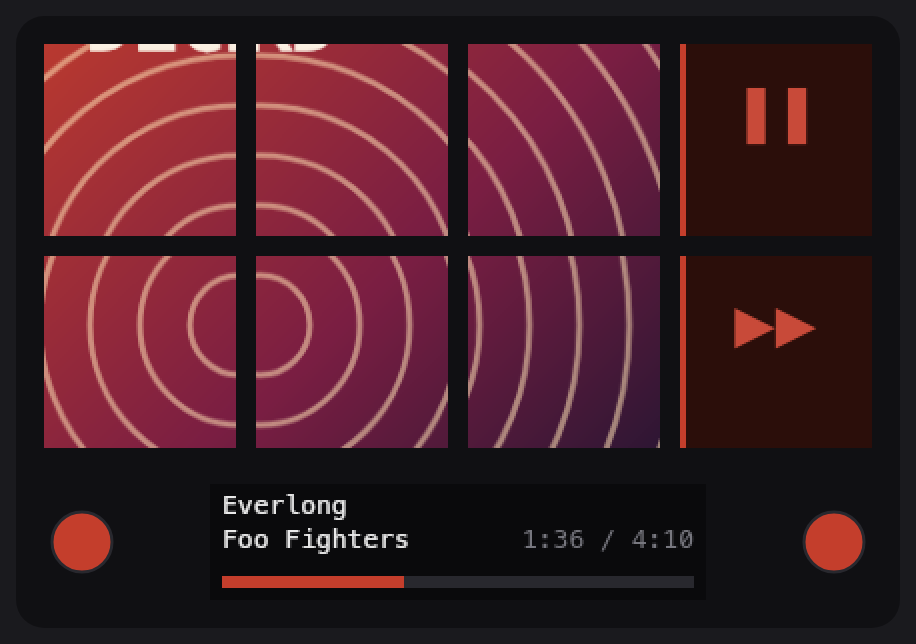
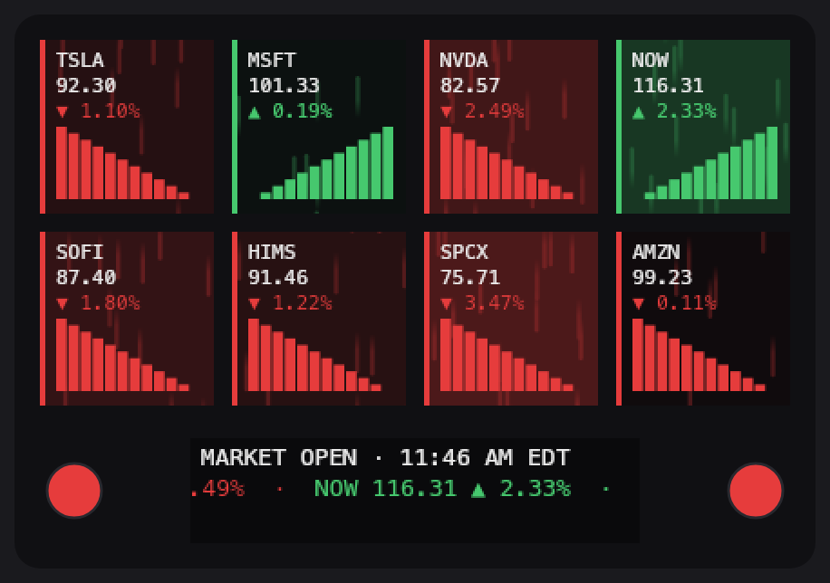
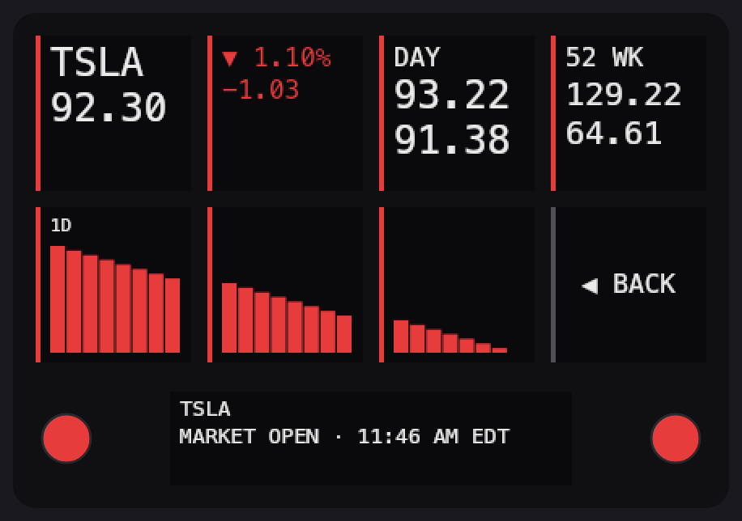
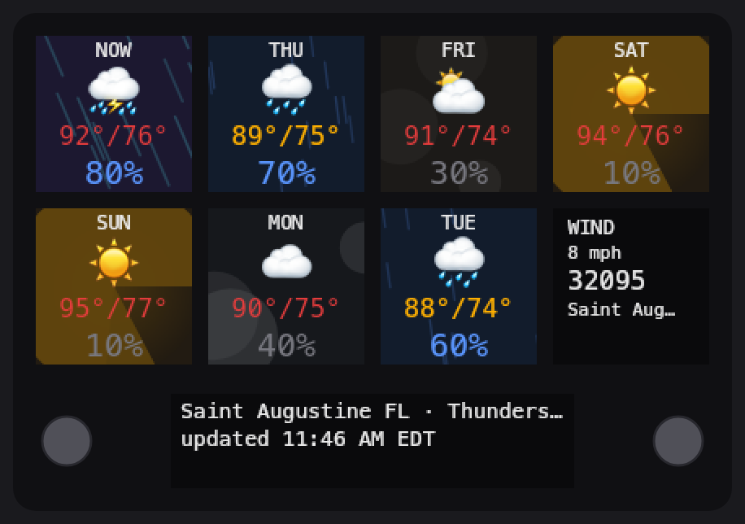
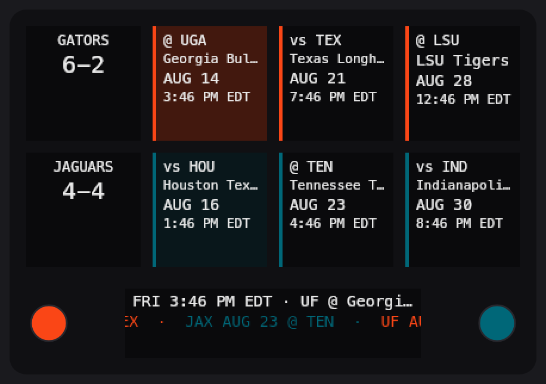
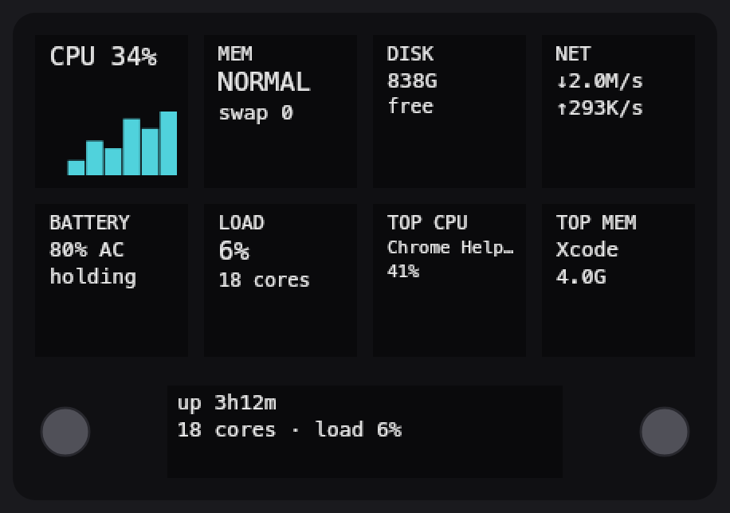

# streamdeckneoclaude

A complete software takeover of an Elgato Stream Deck Neo, written from scratch
for macOS. The Elgato application is removed from the picture. One Node daemon
owns the USB device, draws every pixel itself, and turns the deck into a live
dashboard for the work happening on the Mac.



Seven pages. Live Claude Code sessions, OpenAI Codex tasks, Spotify, stocks,
weather, football, and machine vitals. The two round buttons flip pages. A key
press acts on the thing it shows.

| | |
| --- | --- |
| **Device** | Stream Deck Neo, USB `0x0FD9:0x009A`, stock firmware `1.00.011` |
| **Surface** | 8 keys of 96 × 96 px, one 248 × 58 px info strip, 2 RGB round buttons |
| **Runtime** | Node 22, TypeScript, `@napi-rs/canvas`, no Elgato software |
| **Tests** | 1808 unit tests across 41 files, no hardware needed |
| **Source** | ~17,000 lines of source, ~25,000 lines of test |

---

## Contents

- [The pages](#the-pages)
- [Driving the Neo without Elgato's software](#driving-the-neo-without-elgatos-software)
- [How it reads the data it shows](#how-it-reads-the-data-it-shows)
- [Architecture](#architecture)
- [Install](#install)
- [Spotify](#spotify)
- [Permissions and privacy](#permissions-and-privacy)
- [Development](#development)
- [Troubleshooting](#troubleshooting)
- [Documentation map](#documentation-map)
- [Credits](#credits)

---

## The pages

Every image below is a real frame. The screenshot script drives the real page
class through the real renderer, with fixture data in place of live sources.
No image here is drawn by hand. Run `npm run page:shots` to rebuild them all.

### Claude


Keys 0 to 2 hold live Claude Code sessions, one per key. The border colour and
the ambient motion both name the state, so the two can never disagree.
`thinking` drifts vertically. `tool` streaks horizontally. `permission` pulses
the whole tile, because that is the one state where you are the bottleneck.
Press a session key and the Mac raises that terminal window.

Key 3 is an animated crab mascot. It runs at about 10 fps and takes the most
urgent state on the deck.

Keys 4 to 7 are gauges: the 5-hour cap, the 7-day cap, the burn rate against
the elapsed fraction of the window, and the reset countdown. The gauge
backgrounds carry a wash of their own percentage.

### Codex



Keys 0 to 2 show active Codex tasks with project, title, and model. Key 3
names the page and counts the active tasks. Keys 4 to 7 show the account
usage window, a second limit window when Codex reports one, the current task
token total, and the reset countdown.

The page is read-only. Codex exposes no supported local command to focus a
task, so no key claims to do it.

### Spotify



Album art spans six keys. The accent colour is sampled from the cover, once,
when the art decodes — never on the render path.

Key 3 is the labelled play/pause, and key 7 skips. But **every key except 7
toggles playback**, the six art cells included, so the control you reached for
is always under your finger. Key 3 is simply the discoverable one.

The strip shows the track, the artist, elapsed and total time, and a progress
bar tinted with the cover's own colour.

When nothing plays, the page runs a glyph-rain idle animation instead of an
empty grid.

### Stocks



Eight watchlist symbols: `TSLA`, `MSFT`, `NVDA`, `NOW`, `SOFI`, `HIMS`,
`SPCX`, `AMZN`. Each tile carries the price, the day's change, and an
intraday sparkline. The heat wash is relative to the day's own spread, so a
flat day does not paint eight identical tiles. The strip scrolls a ticker
tape and names the market state.

Press a symbol for the detail view:



Price, change, day range, 52-week range, and three chart ranges across the
bottom row. Key 7 goes back.

### Weather



Seven forecast tiles with a colour emoji, the high and low, and the rain
chance. Each tile runs an ambient effect matched to its condition — rain
falls, snow drifts, storms strike, wind streaks. Key 7 shows wind, the ZIP,
and the place name. Data comes from the US National Weather Service.

### Football



Two teams, one row each. Key 0 and key 4 show the crest and the season
record. The next three games follow on each row, with the opponent, the
kickoff date, and the local time. The two round buttons differ on this page
alone: each light names its own row. The strip scrolls the combined
schedule.

### System



CPU with a sparkline, memory pressure and swap, free disk, network rates,
battery, load average, and the top process by CPU and by memory. Everything
comes from `df`, `pmset`, `netstat`, `sysctl`, and `ps` at absolute paths.

Disk uses `/System/Volumes/Data`, not `/`. On a modern Mac `df /` reports the
read-only system snapshot and would print 2 percent used on a full drive.

---

## Driving the Neo without Elgato's software

This is the part that makes the project what it is. It is worth being exact
about what was and was not done.

### What "custom" means here — and what it does not

**The Neo's firmware is untouched.** It still runs the stock Elgato build
`1.00.011`. Nothing here flashes an image, patches a bootloader, or unlocks a
protected mode. There is no jailbreak, and the device needs none.

What the project replaces is the **host software**. Elgato's application is a
userspace program that opens the deck over USB HID and pushes pixels to it.
So is this. The difference is that this one is ours: every frame, every
animation, every key binding, and every recovery path is written here. The
device is a dumb pixel surface with buttons, and whoever holds the HID handle
owns it completely.

That distinction matters practically. Because the firmware is stock, the deck
survives any bug in this daemon, unplugs cleanly, and still works with
Elgato's software if you ever quit `deckd` and launch theirs. Nothing here is
one-way.

### Taking the device

HID access to the deck is **exclusive**. Exactly one process on the machine
can hold it. `deckd` enumerates with `listStreamDecks`, opens the Neo with
`openStreamDeck`, and reports a busy device with a real explanation rather
than a stack trace:

```
cannot open the Stream Deck Neo
Quit the Elgato Stream Deck app or another deckd instance.
```

Enumeration retries, so starting with the cable unplugged is not fatal. The
daemon simply waits, and paints a full frame the moment the deck appears.

### The surface, measured

Every number below was measured on the real device, not read from a
datasheet. A press listener confirmed every control index by eye.

| Control | Index | Detail |
| --- | --- | --- |
| Keys, top row | 0, 1, 2, 3 | 96 × 96 px LCD |
| Keys, bottom row | 4, 5, 6, 7 | 96 × 96 px LCD |
| Left round button | 8 | RGB backlight only, no screen |
| Right round button | 9 | RGB backlight only, no screen |
| Info strip | segment 0 | 248 × 58 px, one image, no sub-regions |

The strip does **not** support region writes on this model. It takes one
248 × 58 image or nothing.

### The pixel protocol

The deck takes **raw pixel buffers**, not encoded images. The write surface
is four calls:

```
fillKeyBuffer(keyIndex, buffer, { format })   // one 96×96 key
fillLcd(lcdIndex, buffer, { format })         // the whole 248×58 strip
fillKeyColor(keyIndex, r, g, b)               // an RGB round button
setBrightness(percent)                        // a HID feature report
```

`format` accepts `'rgb'`, `'rgba'`, `'bgr'`, or `'bgra'`. **There is no
`'png'`.** So the renderer never encodes anything: `renderKey` and
`renderStrip` return raw RGBA straight out of a canvas, and that buffer goes
to USB unchanged.

There is a matching constraint on the way in. `@napi-rs/canvas` has **no
synchronous image decode**. Setting `img.src = buf` fills in `width`,
`height`, and `complete` immediately, but the pixels are not ready, and a
later `drawImage` paints transparent black. Only `await loadImage(buf)` gives
a drawable image. The render loop cannot await. So every image in this
project — album art, team crests, crab frames — decodes exactly once, off the
render path, and the already-decoded `Image` travels inside the key
description.

### Throughput, benchmarked on the real device

| Scope | Rate |
| --- | --- |
| One key | 2043 key-writes/sec |
| Four keys | 422 key-writes/sec → 105 fps as a group |
| All eight keys | 362 key-writes/sec → 45 fps as a group |
| The strip | 1218 writes/sec |

USB is not the animation constraint. The daemon's own render interval is.
Each page therefore declares its own tick rate, and declares it from what
actually moves — the Claude page holds a fixed 100 ms for the mascot, while
the stocks and football pages raise their rate only while a tape is
scrolling.

Even so, the daemon writes as little as possible. It hashes every key
description against the last one drawn and sends only the keys that changed.
A page can render ten times a second and cost nothing on unchanged content.

### The wedged handle, and the health ladder

This is the hardest thing the project learned about the hardware, and it is
not in any documentation.

**The deck can hold an open handle whose every write fails.** Measured on
2026-08-23, after a run of USB drops, `openStreamDeck` returned a handle that
rejected every write with IOKit `0xE00002C2` (invalid argument), while the
library's `'error'` event never fired again. `isConnected()` stayed true, no
retry was ever scheduled, and no key presses arrived. The deck had neither
input nor output for three hours. The privacy blank at lock time failed on
that handle and left a locked Mac's last frame lit on the desk.

The measured error codes:

| Code | Meaning | Behaviour |
| --- | --- | --- |
| `0xE00002D8` | not ready | Transient, seen during cable churn, recovers on reconnect |
| `0xE00002C2` | invalid argument | The wedged handle. Persisted for three hours |
| `0xE00002D7` | device offline | Seen from `hid_open_path` while enumerating |

Two message shapes tell you which call failed. Pixel writes say `Cannot write
to hid device`. Brightness says `could not send feature report to device`.
The library's `'error'` event comes from the **read** loop only, so it cannot
be the only trigger for a reconnect.

The fix deliberately does **not** classify error codes. A taxonomy only ever
covers the failures already seen, and the next unknown code wedges you again.
Instead the daemon holds one invariant:

> **Connected means the handle accepted a write recently.**

Any failed write makes the handle suspect. A 15-second heartbeat probes a
handle that has gone quiet. A suspect handle is recycled, which costs about
two seconds. Five consecutive sessions that open but never write is treated
as unrecoverable: the daemon notifies the user and exits, and launchd's
`KeepAlive` starts a clean process.

Verified in the failing state rather than a convenient one: three real drops
inside one 8-second burst each recycled the handle, reconnected in about two
seconds, and logged `device write path recovered after 2s`. The process kept
its pid throughout. The heartbeat itself caused no failures.

### Lock, sleep, and the dark deck

A deck on a desk is a display. It must not keep showing your work after you
walk away.

`deckd` polls `ioreg -n Root -d1 -k IOConsoleLocked` every two seconds. On
lock it blanks all eight keys, the strip, and both buttons, sets panel
brightness to zero, pauses the visible page's network source, and ignores
every press. On unlock it repaints a full frame.

Two measured facts shape this:

- **`CGSSessionScreenIsLocked` does not work here.** It returns no such
  property on this machine. The first live lock test failed silently because
  an absent property was read as "unlocked". Absence is now an explicit
  unknown, logged, and never treated as a safe state.
- **The screen-lock grace period is 5 seconds.** So on an Apple-menu Sleep,
  `IOConsoleLocked` is still `No` when macOS suspends the daemon. `deckd`
  gets no sleep notification and learns about sleep only after waking, from a
  clock-gap check. A deck left lit through a sleep is expected, unless the
  lock lands first.

`deckd` holds no power assertion. If the Mac will not sleep, this daemon is
never the cause.

### Living under launchd

The install writes a launchd agent, `com.wbard.deckd`, with `RunAtLoad` and
`KeepAlive`. The deck comes up at login and comes back within about two
seconds of any crash or kill. That property is load-bearing: the
unrecoverable path above relies on being able to exit and be restarted clean.

To hand the device to another program, boot the agent out properly. A `pkill`
alone loses the race against `KeepAlive`:

```bash
launchctl bootout gui/$(id -u)/com.wbard.deckd
# ... use the device ...
launchctl bootstrap gui/$(id -u) ~/Library/LaunchAgents/com.wbard.deckd.plist
```

### The companion display

A separate device on the network, a Waveshare ESP32-S3 knob display running
its own custom firmware, shows Spotify. It has no way to know when this Mac
sleeps. So `deckd` sends it a heartbeat every 5 seconds over plain HTTP, and
the knob treats silence as sleep with a 25-second timeout.

The heartbeat tries `knob.local` first and a fixed IP second, because
mDNS resolution from Node proved unreliable on this Mac. The first host to
answer is remembered and tried first from then on, so a DHCP change costs one
failed beat rather than a permanent outage. Override the list with
`KNOB_HOSTS`.

The link fails open in both directions. The knob treats "never heard from" as
awake, and `deckd` never lets a missing display affect anything it does.

That firmware lives in its own repository. It is genuine custom firmware for
an ESP32 board — unlike the Neo, which needs none.

---

## How it reads the data it shows

No page invents data. Where a signal is absent, the deck says so instead of
guessing a safe-looking value.

### Claude Code sessions and usage

Session state comes from the `daisy-statusbar` plugin's state files, which
`deckd` reads and never writes.

Rate limits are harder, because **no file on disk holds them**. Claude Code
sends them to the statusline command on stdin and nowhere else. So the
install wraps `statusLine` in `~/.claude/settings.json`: a small shell script
captures the payload, saves the rate-limit fields, and then runs your real
statusline command with the same stdin.

Your terminal statusline output does not change. That was verified
byte-for-byte, by hash, before and after the wrap. The wrapper also fails
safe at every step, because a statusline that breaks is far worse than a
gauge that shows `--`.

### Codex tasks

`deckd` reads Codex's own local SQLite index at `~/.codex/state_5.sqlite`,
plus its rollout accounting events. It opens the database `mode=ro` and falls
back to `immutable=1` when Codex holds an exclusive lock — which is Codex's
normal resting state, not a rare one. A fallback read is real data and is
shown, but it is never allowed to look as current as a primary read.

Nothing is sent anywhere. This is a local read of local files.

### Everything else

| Page | Source | Key needed |
| --- | --- | --- |
| Spotify | `api.spotify.com`, OAuth PKCE | Your own free app |
| Stocks | `query1.finance.yahoo.com/v8/finance/chart` | None |
| Weather | `api.weather.gov`, `api.zippopotam.us` | None |
| Football | `sports.core.api.espn.com`, `a.espncdn.com` | None |
| System | `df`, `pmset`, `netstat`, `sysctl`, `ps` | None |

A source polls **only while its page is visible**, and emits a change event
only when the data actually changed.

---

## Architecture

One process owns the USB device, because HID access is exclusive.

```
Sources ──▶ Pages ──▶ Renderer ──▶ Device
 (poll)     (pure)     (canvas)     (HID)
                ▲
          PageManager ◀── round buttons 8 / 9
```

- A **Source** owns one external system. It takes an injected clock and
  `fetch`, polls only while its page is visible, and emits `change` only on a
  real change.
- A **Page** is pure. It takes narrow reader interfaces and returns a
  `DeckFrame` description of the whole deck. It never touches canvas or HID,
  so its tests need no hardware and no network.
- The **Renderer** turns descriptions into raw RGBA buffers.
- The **Daemon** compares each key's hash against the last drawn, and writes
  only what changed.

This split is why the screenshots above exist at all. A page is a pure
function from data to a frame, so a script can feed it fixtures and render
the exact frame the device would show.

Layout:

```
src/sources/     one file per external system
src/pages/       one file per page, all pure
src/render/      canvas, theme, text metrics, sprites
src/install/     launchd agent and the statusline wrapper
src/device.ts    the only file that imports the Elgato library
src/daemon.ts    the render loop, lock handling, and press feedback
bin/deckd.ts     the CLI
```

---

## Install

Requires macOS and Node 22 or later.

```bash
npm install
npm run build
node dist/bin/deckd.js install
```

The install does three things, and prints each one:

1. Copies the statusline wrapper into `~/.local/state/deckd/`.
2. Wraps `statusLine` in `~/.claude/settings.json`, after a backup to
   `settings.json.deckd-backup`.
3. Writes and loads the launchd agent, so the deck starts at login.

`node dist/bin/deckd.js uninstall` reverses all three. It leaves the state
directory alone, because that directory holds your Spotify token.

---

## Spotify

```bash
node dist/bin/deckd.js auth spotify --client-id <ID>
```

Create a free app at <https://developer.spotify.com/dashboard> first. Add this
redirect URI exactly:

```
http://127.0.0.1:8888/callback
```

Spotify rejects `localhost` for a plain HTTP redirect, so the URI must use the
loopback IP. Authorization is PKCE only. No client secret is stored, and the
refresh token lives at `~/.local/state/deckd/spotify.json` with mode 0600,
outside the repository.

---

## Permissions and privacy

macOS asks to allow automation the first time the deck focuses a terminal
window. Approve it. Without approval the session keys still show status, but a
press cannot raise the window. Listing individual window titles needs
Accessibility permission as well, which is a separate prompt.

On privacy, the guarantees are:

- The deck blanks itself within about two seconds of a screen lock, and
  ignores presses while locked.
- The Spotify refresh token is never read, printed, or committed.
- Claude and Codex data is read from local files and sent nowhere.
- Logs are at `~/.local/state/deckd/deckd.log`.

---

## Development

```bash
npm test          # 1808 unit tests, no hardware needed
npm run typecheck
npm run build
npm run smoke     # draws a test pattern, needs the real device
npm run page:shots # regenerates every screenshot in this README
```

`npm run smoke` is the fastest way to confirm the device works. It draws a
labelled pattern on all 8 keys, the strip, and both buttons, then prints every
press index. Pass `--once` to draw and exit for an automated check.

The contact-sheet scripts render one subsystem across many states at once, so
a human can judge legibility before anything reaches the deck:

```bash
npm run stocks:contact-sheet
npm run spotify:contact-sheet
npm run football:contact-sheet
npm run fx:contact-sheet
npm run crab:contact-sheet
```

Those outputs are previews and are not committed. The `page:shots` output is
committed, because this README links to it.

To pick up a new build on the installed daemon:

```bash
npm run build && pkill -f "dist/bin/deckd.js start"
```

`KeepAlive` restarts it within about two seconds.

Set `DECKD_STATE_DIR` when a diagnostic must use isolated runtime state
instead of `~/.local/state/deckd`.

CI runs on `macos-14`: typecheck, tests, and build.

---

## Troubleshooting

Start with the read-only triage in
[`docs/DEPLOYMENT.md`](docs/DEPLOYMENT.md#triage-a-live-complaint). A quiet log
is not a healthy log.

| Symptom | Cause |
| --- | --- |
| `cannot open the Stream Deck Neo` | Another process owns it. Quit the Elgato app or a second `deckd`. |
| Gauges show `--` | The statusline wrapper is not installed, or no Claude session has rendered yet. |
| Gauges show `STALE` | No Claude session has rendered a statusline in 15 minutes. |
| Keys show `no session data` | `~/.claude/daisy-statusbar/state.d/` is absent. |
| Codex shows `task data unavailable` | Codex has not created `~/.codex/state_5.sqlite`, or its local schema changed. Other pages keep working. |
| Key 0 shows `SIGN IN` | Run `deckd auth spotify`. |
| A transport key flashes red | No active Spotify device. Start playback somewhere. |
| A press does not focus a window | Approve the macOS automation prompt. |
| The whole deck is dark | Unlock the Mac. The deck restores itself within about two seconds. |
| The deck is lit after the Mac slept | Expected when sleep beat the 5-second lock grace period. |

---

## Documentation map

| File | Contents |
| --- | --- |
| [`AGENTS.md`](AGENTS.md) | Working rules for anyone, human or agent, changing this code |
| [`docs/VERIFIED-FACTS.md`](docs/VERIFIED-FACTS.md) | Everything measured on real hardware. Trust it, or re-measure |
| [`docs/LESSONS.md`](docs/LESSONS.md) | Recurring defect classes and the review rules that catch them |
| [`docs/PROJECT-STATE.md`](docs/PROJECT-STATE.md) | Handoff state, architecture, and the task ledger |
| [`docs/DEPLOYMENT.md`](docs/DEPLOYMENT.md) | Triage, safe deployment, verification, and recovery |

`VERIFIED-FACTS.md` is the one to read first. Several of its entries
contradict what the original design assumed, and each wrong assumption cost a
fix round.

---

## Credits

The crab sprite art comes from
[clawd-on-desk](https://github.com/rullerzhou-afk/clawd-on-desk) by
rullerzhou-afk, used under the MIT license.

The session state feed comes from the `daisy-statusbar` Claude Code plugin.
This project reads its state files and writes nothing to them.

USB HID transport comes from
[`@elgato-stream-deck/node`](https://github.com/Julusian/node-elgato-stream-deck).
Everything drawn on the device is this project's own.
